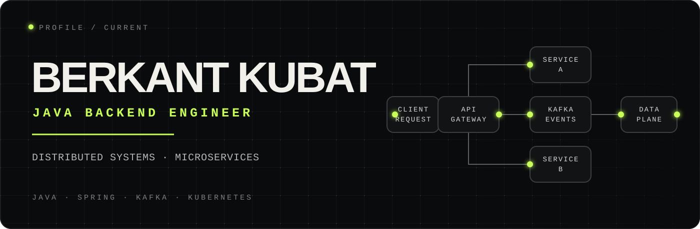
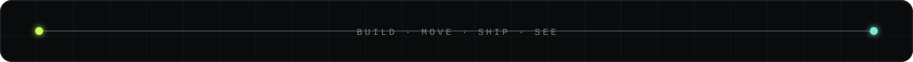

<p align="center">
  
</p>

<p align="center">
  <code>MICROSERVICES &amp; EVENT-DRIVEN ARCHITECTURE</code>
  &nbsp;·&nbsp;
  <code>APACHE KAFKA / SPRING BOOT / KUBERNETES</code>
  <br />
  <code>SCALABLE HIGH-PERFORMANCE SYSTEMS</code>
  &nbsp;·&nbsp;
  <code>CLEAN CODE / SOLID PRINCIPLES / DDD</code>
</p>

<p align="center">
  <a href="https://www.linkedin.com/in/berkantkubat/">
    
  </a>
  <a href="https://furkanberkant.github.io/">
    
  </a>
  <a href="mailto:berkantkubat.dev@gmail.com">
    
  </a>
  <a href="https://github.com/FurkanBerkant">
    
  </a>
</p>

---

## `01 / ABOUT ME`

> **Software Engineer** crafting high-throughput distributed systems that
> scale.

I specialize in **microservices architecture** and **event-driven design
patterns** — turning complex engineering problems into elegant,
production-grade solutions. My work lives at the intersection of performance,
reliability, and clean design.

```java
public class BerkantKubat {

    private final String role     = "Software Engineer";
    private final String focus    = "Distributed Systems & Microservices";
    private final String location = "Türkiye 🇹🇷";

    private final List<String> currentlyExploring = List.of(
        "Domain-Driven Design patterns",
        "Event Sourcing & CQRS",
        "gRPC & Protocol Buffers at scale"
    );

    public String contact() {
        return "berkantkubat.dev@gmail.com";
    }
}
```

---

## `02 / TECH STACK`

<div align="center">

### `BUILD / CORE`


### `MOVE / MESSAGING & APIS`


### `STORE / DATABASES & CACHING`


### `SHIP / DEVOPS & CLOUD`


### `SEE / OBSERVABILITY`


</div>

---

## `03 / WHAT I BUILD`

<table>
  <tr>
    <td valign="top" width="50%">

### `BUILD / 01` Microservices Architecture

Designing loosely-coupled, independently deployable services with clearly
defined domain boundaries. Focused on resilience patterns like circuit
breakers, retries, and saga orchestration.

</td>
    <td valign="top" width="50%">

### `MOVE / 02` Event-Driven Systems

Building Kafka-based event streaming pipelines for real-time data processing.
Experience with exactly-once semantics, consumer groups, and schema evolution
using Avro/Protobuf.

</td>
  </tr>
  <tr>
    <td valign="top" width="50%">

### `TUNE / 03` Performance Engineering

Strategic caching with Redis & Caffeine, async processing with virtual threads,
and query optimization across both relational and NoSQL databases.

</td>
    <td valign="top" width="50%">

### `SEE / 04` Observability & GitOps

End-to-end observability stacks using Prometheus, Grafana, and Loki. Automated
deployments with ArgoCD and Helm on Kubernetes clusters.

</td>
  </tr>
</table>

---

## `04 / GITHUB SIGNALS`

<div align="center">
  
  
</div>

<div align="center">
  
</div>

<div align="center">
  
</div>

---

## `05 / EDUCATION & CERTIFICATIONS`

**B.Sc. Statistics & Computer Science** — *Karadeniz Technical University*
`2019 – 2023`

<br />

| Certificate | Provider | Domain |
| --- | --- | --- |
| Spring Boot Development | Amigoscode | Backend Engineering |
| Java Backend Web Development | Patika.dev | Web Development |
| Cybersecurity Fundamentals | IBM | Security |
| DevOps & Agile Practices | IBM | DevOps |

---

## `06 / LET'S CONNECT`

<div align="center">

I'm always open to discussing **system design**, **distributed architectures**,
or **collaborating on challenging projects**.

<br />

[](https://www.linkedin.com/in/berkantkubat/)
[](https://furkanberkant.github.io/)
[](mailto:kubatb35@gmail.com)

<br />



</div>
