<div align="center">


<br/>

[](https://git.io/typing-svg)

<br/>

[](https://www.linkedin.com/in/berkantkubat/)
[](https://furkanberkant.github.io/)
[](mailto:berkantkubat.dev@gmail.com)
[](https://github.com/FurkanBerkant)

</div>

---

## 🧑‍💻 About Me

> **Software Engineer** focused on building reliable Java backend systems.

I work primarily with **Java & Spring Boot**, with professional experience in **microservice** and **event-driven** architectures. I enjoy understanding how backend systems behave beyond the happy path — from asynchronous communication and caching to data consistency, deployment, and observability.

My current focus is strengthening the engineering fundamentals behind **distributed systems, system design, Domain-Driven Design, and cloud architecture**.

```java
public class BerkantKubat {

    private final String role     = "Software Engineer";
    private final String focus    = "Java Backend Engineering";
    private final String location = "Türkiye 🇹🇷";

    private final List<String> professionalStack = List.of(
        "Java & Spring Boot",
        "Apache Kafka & Redis",
        "PostgreSQL & Cassandra",
        "Docker & Kubernetes",
        "ArgoCD, Prometheus & Grafana"
    );

    private final List<String> currentlyDeepening = List.of(
        "Distributed Systems",
        "Domain-Driven Design",
        "System Design",
        "AWS"
    );

    public String contact() {
        return "berkantkubat.dev@gmail.com";
    }
}
```

---

## 🛠️ Tech Stack

<div align="center">

### ☕ Backend


### 📨 Messaging, Data & Caching


### ☁️ Platform & Delivery


### 📊 Observability


### 📚 Currently Deepening


</div>

---

## ⚙️ What I Build & Work With

<table>
  <tr>
    <td valign="top" width="50%">

### 🏗️ Microservices
Working with Java and Spring Boot services in microservice environments, with a focus on clear responsibilities, maintainable boundaries, and reliable service communication.

</td>
    <td valign="top" width="50%">

### 📡 Event-Driven Systems
Using Apache Kafka for asynchronous communication between services and reasoning about producers, consumers, event flows, retries, and failure scenarios.

</td>
  </tr>
  <tr>
    <td valign="top" width="50%">

### ⚡ Data & Performance
Working with PostgreSQL, Cassandra, and Redis while thinking about caching, query behavior, consistency, and the trade-offs behind data-access decisions.

</td>
    <td valign="top" width="50%">

### 🔭 Platform & Observability
Running containerized services with Docker and Kubernetes, using ArgoCD for delivery workflows and Prometheus/Grafana for monitoring and observability.

</td>
  </tr>
</table>

---

## 📊 GitHub Stats

<div align="center">
  
  
</div>

<div align="center">
  
</div>

---

## 🎓 Education & Certifications

🎓 **B.Sc. Statistics & Computer Science** — *Karadeniz Technical University* `2019 – 2023`

<br/>

| Certificate | Provider | Domain |
|-------------|----------|--------|
| Spring Boot Development | Amigoscode | Backend Engineering |
| Java Backend Web Development | Patika.dev | Web Development |
| Cybersecurity Fundamentals | IBM | Security |
| DevOps & Agile Practices | IBM | DevOps |

---

## 🤝 Let's Connect

<div align="center">

Open to **Java Backend / Software Engineer opportunities** and conversations around backend systems, distributed architectures, and software engineering.

<br/>

[](https://www.linkedin.com/in/berkantkubat/)
[](https://furkanberkant.github.io/)
[](mailto:berkantkubat.dev@gmail.com)

<br/>


</div>
